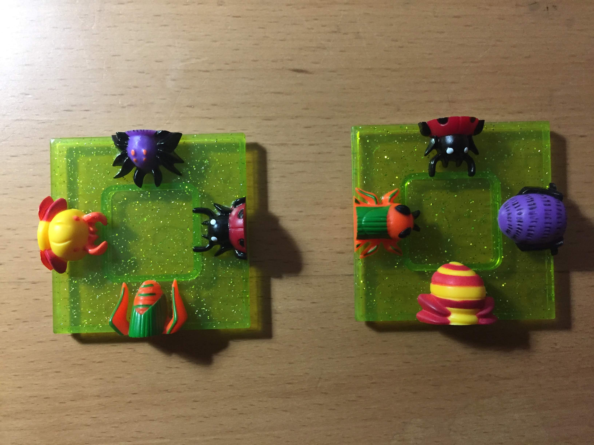

# Game
This code will solve the 3D Squares game by DaMert Company


# Strategy
The solution I coded uses recursion to find the solution.
We start with the empty square and the 9 tiles.
At each step, we generate all the possible options.
For example the first step generates 36 different positions (9 tiles + 4 rotations for each)

# Representations of the tiles
The "dictionary" number <--> animal
- grasshopper -1 & 1 (green orange)
- spider -2 & 2 (purple)
- lady bug -3 & 3 (red)
- beetle -4 & 4 (yellow)
Positive numbers are heads.
Negative numbers are tails.

A tile is a list of 4 numbers representing the animals
```
      0
 +--- X ---+
 |         |
 |         |
3X         X 1
 |         |
 |         |
 +--- X ---+
      2
```

For example:

are the 2 tiles:
- [4,2,3,-1]
- [1,3,-2,-4]

# Solved puzzle

